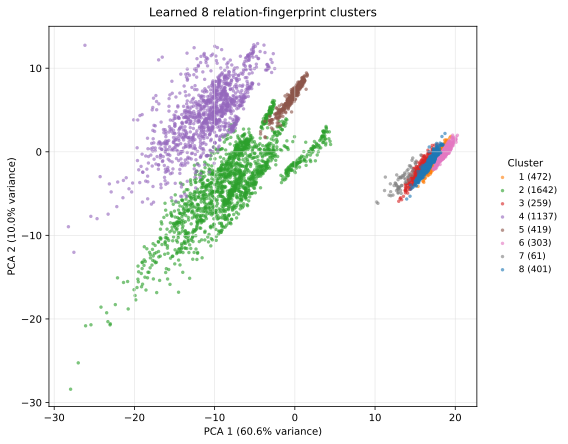
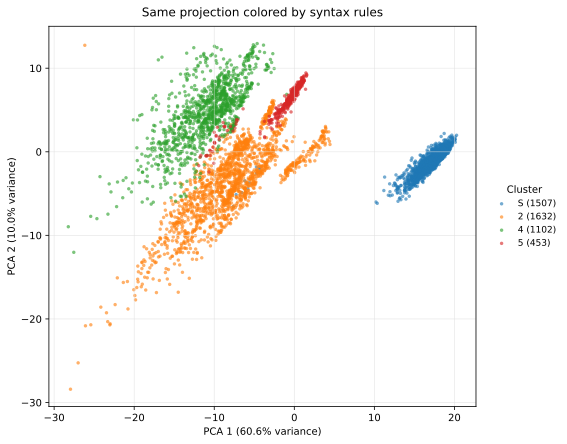

# The SAIR distillation challenge stage 1

*A postmortem of a syntax-driven attempt at the first SAIR mathematics distillation challenge.*

**Lothar S. Schiemanowski and GPT-5.5 · May 4, 2026**

[Code and reproduction instructions](REPRODUCTION.md)

The [SAIR distillation challenge](https://competition.sair.foundation/competitions/mathematics-distillation-challenge-equational-theories-stage1/overview) is a series of competitions. The basic idea is to compress mathematical knowledge about a certain mathematical subject matter into a short text, which enables a non-frontier LLM to competently answer questions about this subject. As I understand it, the aim is to discover/uncover mathematical strategies of theory building. On the other hand, it is also enticing from a machine learning point of view. This is because the concrete problem comes with a dataset on the one hand and a verifiable problem on the other. This invites an approach which relies on data analysis, rather than mathematical understanding. Unfortunately, in my case, this attempt at reward hacking the competition led to abject failure. While my solution performed well on the public dataset, it failed miserably on one part of the evaluation dataset. In fact, it failed astonishingly on one particular part of the evaluation dataset, which is appropriately called the extra hard split: the two stronger models using my solution scored 1.0% correct on this dataset, where a coin toss would have scored 50.0%. In this blog post I want to describe my approach and analyze why it failed as spectacularly as it did.

Before diving into that, I first want to describe the concrete task in the competition and its mathematical background.

A magma is a set $M$ with a binary operation $\ast : M \times M \to M$. In mathematics binary operations are ubiquitous, the most common being addition and multiplication. And so examples of magmas are the real numbers equipped with the binary operation of addition, or the real numbers equipped with the binary operation of multiplication. More generally, any group is a magma. The conditions placed on the binary operation of a group are very restrictive. On the other hand, the binary operation of a generic magma only satisfies that $a \ast b$ is again an element of the magma. The word magma evokes an amorphous object and that is the right way to think about this. While there is only one group with three elements up to isomorphism, there are 3330 magmas with 3 elements up to isomorphism. For four elements, there are two groups up to isomorphism and 178981952 magmas up to isomorphism.

A metamathematical question you may pose is: what interesting, more restrictive structures can you add to magmas? One particular answer is the group property, but there are many more possibilities and it is possible that as yet unexplored structures can be placed on binary operations, which have rich, beautiful theories like group theory.

One way to impose an extra condition is by means of an equation, such as $\forall x, y : x \ast y = y \ast x$ (commutativity) or $\forall x, y : x = y$. The latter equation implies that the magma contains only one element. On the other hand, the equation $\forall x : x = x$ doesn't impose any condition at all.

Instead of always writing the quantifiers we will only write the equation and silently assume that it holds for every choice of assignment to the variables. Given two equations $E_1$ and $E_2$ a natural question is whether $E_1$ implies $E_2$, $E_2$ implies $E_1$, $E_1$ is equivalent to $E_2$ or none of the above. Natural as this question is, its salience becomes clearer when you expand the scope from a single pair of equations to all possible equations in magmas: what then emerges is a space of "theories" in magmas.

The Equational Theories project, launched on September 25, 2024, was a massively collaborative mathematical project to understand the relationship between equations in magmas. The project considered all equations in a magma with at most four occurrences of the magma operation, up to symmetry and relabeling. There are 4694 such equations and the goal was to answer for any pair $(E_1, E_2)$ of such equations if $E_1 \implies E_2$.

By late November 2024 the project successfully answered this question for all 22,028,942 such non-reflexive pairs. By April 2025, all implications and non-implications were validated in the proof assistant Lean. This was achieved through collaboration of many contributors, working with and without proof assistants and automated theorem provers.

As of April 2026, many LLMs are capable of determining if $E_1 \implies E_2$ is true or false autonomously. On the other hand, smaller models or non-reasoning models struggle with that task - in some cases doing no better than chance. This is where the first SAIR mathematics distillation challenge comes in.

The task is to write a cheatsheet, which allows a small model to answer such questions effectively. The cheatsheet is capped at 10kb length. The cheatsheet is evaluated on a private test set by the following models:

- gpt-oss:120b with low reasoning effort

- Gemma-4-31b with no reasoning

- Llama 3.3-70b

The goal is to write a cheatsheet which achieves the highest cumulative score.

The idea behind this is that good mathematics can provide shortcuts and good heuristics to answering problems, which by brute force are inaccessible or very difficult. gpt-oss:120b and Gemma-4-31b with full reasoning are very capable models and are able to answer many questions effectively, but they will burn through many tokens to do so.

With the announcement of the competition, the SAIR foundation released a dataset consisting of 1869 problems, divided into five splits: normal, hard, hard1, hard2 and hard3.

The official scored evaluation used three splits: normal, hard and extra_hard. There was also a separate order-5 research leaderboard, consisting of equations with five occurrences of the magma operation.

My data-analysis-driven approach scored as follows on the released SAIR dataset, in its strongest mechanical version:

| Data Set | Accuracy |
| -------- | --------: |
| Normal | 96.9% |
| Hard | 64.5% |
| Hard1 | 69.6% |
| Hard2 | 89.5% |
| Hard3 | 57.8% |
| Overall | 83.3% |

The official scored evaluation leaderboard gives the harsher, and more relevant, picture. My submitted cheatsheet ranked 288th out of 310 scored entries. It scored 2719 correct answers out of 5400, for an average accuracy of 50.4% across the three evaluation models and three evaluation splits.

| Evaluation Split | Accuracy |
| --- | ---: |
| Normal | 77.0% |
| Hard | 61.3% |
| Extra Hard | 12.7% |

The extra_hard split is where the failure is most visible. On this split, both Gemma-4-31b and gpt-oss:120b scored 1.0% with my cheatsheet. Llama 3.3-70b scored 36.2%.

Along with this official evaluation, the SAIR foundation also released and evaluated a dataset of equations with 5 magma operations. On this dataset my solution ranked second among the 310 entries. Presumably this dataset was not curated, but sampled randomly and luckily the syntactic features I identified for the problems with 4 magma operations generalized to problems with 5 magma operations.

In this blog post, I want to describe my approach to this competition. It is a story of machine learning, rather than of mathematics. The principal reasons for choosing this approach, which avoids semantic understanding of the question, are that Llama 3.3-70b is a rather weak model and that I was curious how far this approach could be pushed.

What I arrived at - with ample help by GPT-5.4 - is a syntactic classification, which can be reduced to a checklist. Across the public SAIR dataset, this syntactic classification leads to an accuracy of 83.3%.

The code for the analysis is available at [github.com/lschiemanowski/SAIR_stage_1](https://github.com/lschiemanowski/SAIR_stage_1).

The goal was to classify equations semantically by syntactic features. In the end I identified 4 classes of equations and a 4 x 4-table, which allows one to read off the probability that an equation of type A implies an equation of type B. This proceeded in four steps:

1. Train a syntax-aware embedding of equations, together with a relation model on pairs $(E_1, E_2)$ of equations, which is then used to predict if $E_1 \implies E_2$.

2. Cluster the equations into 8 clusters and compute the associated 8 x 8-table.

3. Coarsen the clusters to 4 clusters, which preserve most of the predictive power of the 8 x 8-table.

4. Try to find syntactic types for each cluster and replace clusters by these syntactic types.

I will now describe these steps in more detail.

Each equation is first parsed as a binary tree. The variables are represented by learned vectors and the magma operation is represented by a learned composition map. The embedding of each side of the equation is obtained by applying the formula via the learned composition map to the vectors representing the variables. This gives a vector $h_L$ and a vector $h_R$ for each side of the equation.

  To represent the equation, we form $(h_L + h_R, |h_L - h_R|)$, where the modulus is applied coordinatewise. This form is chosen, because it doesn't matter for the meaning of the equation, if the two sides are swapped. We feed this vector through an MLP. The result is an embedding $e(E)$ of the equation. To predict whether $E_1$ implies $E_2$, the model then uses the ordered pair of embeddings $(e(E_1), e(E_2), e(E_1)-e(E_2), e(E_1)\odot e(E_2))$, where the last product is coordinatewise multiplication. This ordered feature vector is then fed through a small relation MLP. Here the order matters: implication is not symmetric, and so the model should be able to score $(E_1,E_2)$ differently from $(E_2,E_1)$. This is reflected in the choice of the embedding.

The trained relation model by itself is already quite accurate on random held-out pairs from the full equational theories graph. But this is not yet a cheatsheet. It is also not yet a satisfying mathematical explanation. Its use for me was that it gave a way to define a geometry on the set of equations.

The next step was to cluster equations. Given a list of anchor equations $A_1,\ldots,A_n$, the fingerprint of an equation $E$ is

$$
\big(s(E,A_1),\ldots,s(E,A_n),s(A_1,E),\ldots,s(A_n,E)\big),
$$

where $s(X,Y)$ is the learned score for $X \implies Y$. In other words, two equations are close if the relation model thinks that they imply the same anchors and are implied by the same anchors. This is a semantic or behavioral clustering, even though the model which produces it only has access to syntax. Since we have access to the ground truth, in principle we could have done this for all equations and dispensed with the model. This also leads to a useful clustering, but in my experiments they weren't syntactically interpretable. This is what the syntax-based embedding added.

Clustering these fingerprints into 8 clusters produced the following implication probability table. The rows are the type of the source equation and the columns are the type of the target equation.

| Source / Target | 1 | 2 | 3 | 4 | 5 | 6 | 7 | 8 |
| --- | ---: | ---: | ---: | ---: | ---: | ---: | ---: | ---: |
| 1 | 100.0% | 100.0% | 100.0% | 100.0% | 100.0% | 100.0% | 100.0% | 100.0% |
| 2 | 0.0% | 9.4% | 0.0% | 8.5% | 0.0% | 0.0% | 0.0% | 0.0% |
| 3 | 100.0% | 100.0% | 100.0% | 100.0% | 100.0% | 100.0% | 100.0% | 100.0% |
| 4 | 0.0% | 0.0% | 0.0% | 7.1% | 0.0% | 0.0% | 0.0% | 0.0% |
| 5 | 0.0% | 0.0% | 0.0% | 100.0% | 100.0% | 0.0% | 0.0% | 0.0% |
| 6 | 100.0% | 100.0% | 100.0% | 100.0% | 100.0% | 100.0% | 100.0% | 100.0% |
| 7 | 100.0% | 100.0% | 100.0% | 100.0% | 100.0% | 100.0% | 100.0% | 100.0% |
| 8 | 100.0% | 100.0% | 100.0% | 100.0% | 100.0% | 100.0% | 100.0% | 100.0% |

The same clustering can be visualized by projecting the relation fingerprints to two dimensions. This picture is only a visualization; the clustering itself was done in the full fingerprint space.

Five of the eight rows are identical: clusters 1, 3, 6, 7 and 8 imply everything. Cluster 5 is also very simple: it implies clusters 4 and 5, but nothing else. Clusters 2 and 4 are mostly weak and mostly do not imply anything. The only nonzero entries in their rows are small self- or near-self probabilities.

This immediately suggests a coarsening. If clusters 1, 3, 6, 7 and 8 behave identically for the purpose of implication prediction, there is no reason to distinguish them in a cheatsheet. So I collapsed them into one strong type, which I will call $S$, and kept clusters 2, 4 and 5 as separate types. This gives the following 4 x 4 table:

| Source / Target | S | 2 | 4 | 5 |
| --- | ---: | ---: | ---: | ---: |
| S | 100.0% | 100.0% | 100.0% | 100.0% |
| 2 | 0.0% | 9.4% | 8.5% | 0.0% |
| 4 | 0.0% | 0.0% | 7.1% | 0.0% |
| 5 | 0.0% | 0.0% | 100.0% | 100.0% |

On the same PCA projection, this coarsening merges the right-hand island into one strong type $S$, while keeping the two weak regions and the special type 5 separate.

Thus the associated rule is very simple:

- an equation of type $S$ implies everything;

- an equation of type 5 implies equations of type 4 and type 5;

- all other type pairs should be treated as non-implications.

On the full Equational Theories graph, the original 8 x 8 table has accuracy 97.7% and balanced accuracy 96.9%. The 4 x 4 collapse has exactly the same accuracy and balanced accuracy. So, at the level of these learned 8 clusters, essentially no information is lost by going from 8 types to 4 types. This does not mean that 4 types are fine-grained enough for every evaluation distribution. It only means that the particular 8-cluster table had already collapsed most of the relevant distinctions.

Before replacing these learned cluster labels by syntax rules, let us look at the performance of this 4 x 4 cluster oracle:

| Split | Balanced Accuracy | Accuracy |
| --- | ---: | ---: |
| Raw Test | 97.0% | 97.7% |
| Normal | 96.8% | 96.8% |
| Hard | 57.4% | 68.5% |
| Hard1 | 58.3% | 71.0% |
| Hard2 | 89.0% | 89.0% |
| Hard3 | 52.6% | 53.8% |
| Evaluation Normal | 83.0% | 83.0% |
| Evaluation Hard | 78.5% | 78.5% |
| Evaluation Extra Hard | 51.0% | 51.0% |

So even before adding syntax rules, the picture is already mixed. The cluster oracle is excellent on the raw test split and on normal examples, and still quite good on hard2 and the evaluation hard split. But it is weak on hard, hard1 and hard3, and it is essentially at chance on evaluation extra_hard. The syntax rules therefore did not create the entire problem from nothing. They made an already uneven transfer problem much worse.

The more interesting question is where this 4-type oracle breaks down. Here the answer is very clean: it almost never makes false positives. Its errors are missed true implications in the weak region. The missed blocks are:

| Split | Errors | Missed True Implication Blocks |
| --- | ---: | --- |
| Raw Test | 49784 | $2 \to 2$: 24977; $2 \to 4$: 15735; $4 \to 4$: 9072 |
| Normal | 32 | $2 \to 2$: 16; $2 \to 4$: 12; $4 \to 4$: 4 |
| Hard | 63 | $2 \to 2$: 47; $2 \to 4$: 16 |
| Hard1 | 20 | $2 \to 2$: 15; $2 \to 4$: 5 |
| Hard2 | 22 | $2 \to 2$: 18; $2 \to 4$: 4 |
| Hard3 | 185 | $2 \to 2$: 97; $2 \to 4$: 57; $4 \to 4$: 31 |
| Evaluation Normal | 34 | $2 \to 2$: 23; $2 \to 4$: 10; $4 \to 4$: 1 |
| Evaluation Hard | 43 | $2 \to 2$: 22; $2 \to 4$: 13; $4 \to 4$: 8 |
| Evaluation Extra Hard | 98 | $4 \to 4$: 83; $2 \to 2$: 15 |

This suggests that the problem is not the distinction between the strong type $S$ and the weak types. That part works very well. The problem is that the weak types are still too coarse. Type 2 and type 4 contain subfamilies which sometimes do imply each other, but the collapsed table treats those blocks as uniformly false.

To test this, I evaluated finer equation clusterings from the same relation-fingerprint method. This is no longer a cheatsheet-sized object, because a 64-cluster oracle assumes that we know the learned cluster of every equation and can use a 64 x 64 table. But as a diagnostic, it is very informative. The entries below are accuracy / balanced accuracy.

| Split | 4 Types | 16 Clusters | 32 Clusters | 64 Clusters |
| --- | ---: | ---: | ---: | ---: |
| Raw Test | 97.7% / 97.0% | 98.2% / 97.8% | 98.6% / 98.3% | 99.3% / 99.2% |
| Normal | 96.8% / 96.8% | 97.7% / 97.7% | 98.0% / 98.0% | 98.9% / 98.9% |
| Hard | 68.5% / 57.4% | 80.5% / 75.6% | 89.0% / 87.4% | 94.0% / 94.1% |
| Hard1 | 71.0% / 58.3% | 82.6% / 76.9% | 89.9% / 88.3% | 94.2% / 94.6% |
| Hard2 | 89.0% / 89.0% | 94.5% / 94.5% | 95.0% / 95.0% | 97.5% / 97.5% |
| Hard3 | 53.8% / 52.6% | 70.5% / 69.8% | 81.5% / 81.0% | 89.0% / 88.7% |
| Evaluation Normal | 83.0% / 83.0% | 88.0% / 88.0% | 88.5% / 88.5% | 93.0% / 93.0% |
| Evaluation Hard | 78.5% / 78.5% | 83.5% / 83.5% | 86.0% / 86.0% | 91.5% / 91.5% |
| Evaluation Extra Hard | 51.0% / 51.0% | 54.5% / 54.5% | 59.5% / 59.5% | 83.5% / 83.5% |

This changes the interpretation of the failure. The relation-fingerprint geometry had not completely missed the hard examples. A finer clustering recovers much of them: hard3 goes from 53.8% to 89.0%, and evaluation extra_hard goes from 51.0% to 83.5%. What failed was the compression step. The four-type collapse is a beautiful cheatsheet-sized object, but it throws away exactly the distinctions needed for the hardest weak-region implications.

Even with 64 clusters, the remaining errors are still concentrated in the same old weak region. On evaluation extra_hard, the remaining 33 errors are 31 missed $4 \to 4$ implications and 2 missed $2 \to 2$ implications. So the extra_hard set seems to probe a real substructure inside old type 4, rather than merely asking for a better threshold.

This sounds much better than it really is. The catch is that the clusters were obtained from the learned relation model. A cheatsheet cannot tell Llama 3.3 to compute a relation fingerprint against thousands of anchors and then run k-means. The clusters still had to be identified syntactically.

This was the next step: inspect the equations in the clusters and try to find human-readable rules. The four types which emerged were roughly as follows:

If we color the same PCA projection by these syntax rules, the broad picture looks similar, but the differences are exactly what matter later: some equations which the learned clustering treats as weak are moved into the strong type $S$.

| Type | Behavior | Syntactic Description |
| --- | --- | --- |
| $S$ | Implies Everything | Usually an equation of the form $x = \ldots$, where the right-hand side begins with another variable and is sufficiently constraining |
| 2 | Weak | Usually an equation of the form $x = \ldots$, where $x$ remains exposed on the right-hand side |
| 4 | Weak | Usually a composite left-hand side; this is the default weak type |
| 5 | Special Weak Type | Usually left-hand side $x \ast y$; implies type 4 and type 5 |

This method is very fragile, because the syntactic descriptions only approximate the clusters, as can be seen by the following table showing the performance on the various splits of the SAIR dataset:

| Split | Balanced Accuracy | Accuracy |
| --- | ---: | ---: |
| Raw Test | 96.6% | 97.3% |
| Normal | 96.6% | 96.6% |
| Hard | 49.9% | 59.0% |
| Hard1 | 51.7% | 62.3% |
| Hard2 | 87.5% | 87.5% |
| Hard3 | 49.6% | 50.8% |
| Evaluation Normal | 80.0% | 80.0% |
| Evaluation Hard | 60.0% | 60.0% |
| Evaluation Extra Hard | 1.0% | 1.0% |

On the public SAIR dataset the performance was quite strong and this is why I submitted this cheatsheet. But performance on the evaluation extra_hard split is catastrophic.

The drop from 51.0% for the 4 x 4 cluster oracle to 1.0% for the 4 x 4 syntax oracle is especially revealing. The evaluation extra_hard split is balanced: 50.0% true implications and 50.0% true non-implications. The learned 4 x 4 cluster oracle gets only 2.0% of the true implications right, but it gets 100.0% of the true non-implications right. This gives 51.0% accuracy. The syntax oracle still gets only 2.0% of the true implications right, but now it gets 0.0% of the true non-implications right. This gives 1.0% accuracy.

So the drop is not caused by losing the positive examples. Both oracles find the same two positive examples and miss the other 98.0%. The whole drop comes from the negative examples. Under the learned cluster labels, all 100.0% of the negative examples have a source equation of type 2, so the 4 x 4 table predicts non-implication. Under the syntactic rules, those same source equations are classified as type $S$, and type $S$ implies everything. Thus every negative example becomes a false positive.

| Share of Extra Hard Non-Implications | Learned Cluster Labels | Syntax Labels |
| --- | --- | --- |
| 51.0% | $2 \to 4$, Predict False | $S \to 4$, Predict True |
| 45.0% | $2 \to 2$, Predict False | $S \to 2$, Predict True |
| 4.0% | $2 \to S$, Predict False | $S \to S$, Predict True |

This is the sharpest form of the failure. The syntactic checklist mistakes a family of behaviorally weak antecedents for the strong type $S$. The evaluation extra_hard split then pairs precisely these antecedents with equations they do not imply. The table itself is not random; the learned cluster assignment would have rejected all of these non-implications. But the human-readable syntax approximation sends them to the one row of the table where every target is accepted.

What are my lessons? One is the classic machine learning dictum to not overfit the training dataset. More concretely, I think the weakness of my approach was to try to apply a purely syntactic approach, rather than a semantic approach. It seems the evaluation dataset was wisely chosen to rank such an approach very lowly. On the other hand, the 4 x 4 table does seem to reflect a genuine semantic structure in the space of equations, and it would be interesting to see if a non-syntactic approach of identifying the clusters can be found. This would almost certainly not work for the Llama 3.3 model, but perhaps the other models would perform strongly.

I believe there are more sophisticated, automated strategies one can employ for this problem, which I didn't attempt, because I lacked both compute and time, but I'm excited about trying them for the next stage of the competition!
